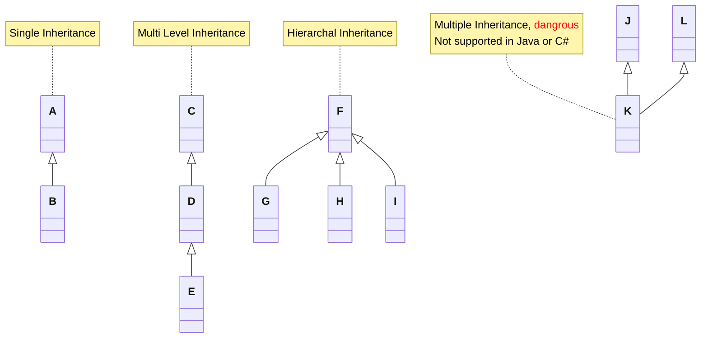
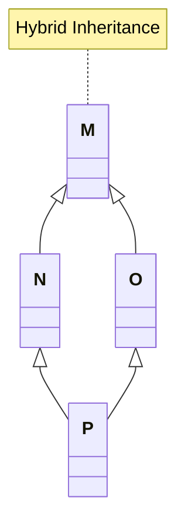

# Introduction  
  
OOP will make it convenient to build big projects.  
  
___      
# What is OOP and Why?  
  
FP(Functional Programming)  
- You may forget the functions you wrote!	  
- You may rewrite a function that is already exists.  
- It is a headache to have thousands of <u>unorganized</u> functions.  
  
OOP makes programming and the way you look at programming near to the way you look at your life.  
A method is a function or procedure inside some class.  
A member of `classX` is a variable, function, or procedure inside the `classX`.  
  
___  
# Classes & Objects  
## Classes and Objects  
It is class because you are classifying(تصنيف) the code of your system.  
  
`struct` is a datatype. It is similar to `int`, `bool`, `string`, ETC.  
`class` is also a datatype.  
  
```cpp  
struct stPerson{};  
stPerson Person01;// we say the variable Person01  
  
class clsPerson{};  
clsPerson Person02;// we say the object Person02  
```  
  
Everything inside the class is Private by default.  
Private members is accessible only from inside the class.  
  
> [!NOTE]  
> Your coding life should be OO from now on.  
  
Example  
```cpp  
class clsPerson {  
	// this is also private  
	string Country;  
private:  
	int Age;  
public:  
	string FirstName;  
	string LastName;  
	string FullName() {  
		return FirstName + " " + LastName;  
	}  
};  
  
int main()  
{  
	clsPerson person;  
	person.FirstName = "Yasin";  
	person.LastName = "Hamad";  
	cout << person.FullName();  
	  
	// You can't access these  
	// person.Age  
	// person.Country  
}  
```  
## Class Members  
Any object is an instance of some class.  
  
Members:  
- Data Members: any variable declared inside the class that holds data. Like `FirstName` and `LastName` in the above example.  
- Function/Method Members: any function or procedure declared inside the class. Like `FullName()` in the above example.  
  
## Objects In Memory  
Each object has its own space in memory, that holds its data members. However, methods are shared btw all objects.  
So, in the object's memory space, you'll find only the data members. The methods are shared btw all objects and have one space for them.  
  
___  
# Access Specifiers/Modifiers  
  
OOP gives you control over the code.  
  
Who can benefit from your members:  
- They can benefit from your members from outside the class.  
- They can benefit from your members from inside the class.  
- All classes that inherits this class.  
  
We have three access specifiers/modifiers for members:  
- public : everyone can see the member and use it.  
- private : only from inside the class you can see the member and use it.  
- protected : from inside the class & the classes that inherits this class can see the member and use it.  
  
You can do what ever you want with the private members, because no one can access them.  
This is security, because you can't access the private members or change them.  
  
The public method may call many private methods to perform its functionality.  
  
___  
# Properties  
## Properties Set and Get  
  
Properties  
- Set property  
- Get property  
  
Do not edit the variables(data members) directly, use properties. This is a rule.  
For each public variable, make two functions, one for edit it, that is `set`, and one for return it, that is `get`. And make the variable private.  
Dot not put public variables in your class. This is a rule. Make them all private.  
We call the function that perform the `set` or `get` a property.  
  
A good habit: make all the private variables start with `_`, like  
```cpp  
private:  
	string _FirstName;  
	string _LastName;  
```  
For simplicity, don't write `getFirstName()`, write `FirstName()`. Just a practice.  
  
<u>Audit trail</u>: setters help you achieve this, for example, each time the `FirstName` change,  
you save the old `FirstName` first, then change it.  
  
Small practice  
```cpp  
class clsPerson {  
	string _LastName;  
	string _FirstName;  
  
public:  
	void setFirstName(string first_name) {  
		// do what ever you want with the old value before changing it  
		_FirstName = first_name;  
	}  
	void setLastName(string last_name) {  
		_LastName = last_name;  
	}  
	string getFirstName() {  
		return _FirstName;  
	}  
	string getLastName() {  
		return _LastName;  
	}  
	string FullName() {  
		return _FirstName + " " + _LastName;  
	}  
};  
  
int main()  
{  
	clsPerson person;  
	person.setFirstName("Yasin");  
	person.setLastName("Hamad");  
  
	cout << "First name is " << person.getFirstName() << "\n";  
	cout << "Last name is " << person.getLastName() << "\n";  
	cout << "Full name is " << person.FullName() << "\n";  
}  
```  
  
## Read Only Property  
  
Before starting the lesson, I guess, we simply do not implement a `set` method.  
Yup, I was right.  
If we have only a `get` method for the variable, so it is read only.  
You can read the variable, but can't edit it.  
  
You can access the variables inside the class from anywhere inside the class, they are like, global variables.  
  
## Properties Set and Get through `=`  
  
See the example below, the new code is just this line  
```cpp  
__declspec(property(get = getFirstName, put = setFirstName)) string FirstName;  
```  
Read the explanation  
```cpp  
class clsPerson {  
	// this is a private variable  
	string _FirstName;  
  
public:  
	// this is the set method for the _FirstName variable  
	void setFirstName(string first_name) {  
		_FirstName = first_name;  
	}  
  
	// this is the get method for the _FirstName variable  
	string getFirstName() {  
		return _FirstName;  
	}  
	  
	// this stands for, declaration specification, it is a class  
	// we use this to make it easier to use the get & set methods  
	// this FirstName is called a property  
	// when you assign something to FirstName, cpp calls setFirstName(FirstName)  
	// when you print it, cpp calls getFirstName()  
	// you can call this property koko, it doesn't matter  
	__declspec(property(get = getFirstName, put = setFirstName)) string FirstName;  
};  
  
int main()  
{  
	clsPerson person;  
	  
	person.setFirstName("Yasin");  
	cout << "First name is " << person.getFirstName() << "\n";  
  
	// here, you're assigning something to the property FirstName  
	// cpp puts the value "Main Yasin" in the variable FirstName  
	// then it calles setFirstName(FirstName) and it gives it the variable FirstName  
	person.FirstName = "Main Yasin";  
	// here, cpp calles getFirstName()  
	cout << "First name is " << person.FirstName << "\n";  
}  
```  
  
So, make it a habit, for each variable in your class, make the `set` and `get` methods, and make a property.   
  
___  
# Encapsulation and Abstraction  
## First Principle/Concept of OOP: Encapsulation  
  
Put all functions & variables that related to each other in one place, in a class.  
Encapsulate the methods and variables in one class. So, you can access these methods & variables only through this class/object.  
  
> Encapsulation: binding together the data and the functions that manipulates them.  
  
## Second Principle/Concept of OOP: Abstraction  
  
As a user, you should only see whet can benefit you.  
You don't see the complexity, even if you see it, it won't benefit you.  
Abstraction is the opposite of distraction(إلهاء).  
Abstraction means, you only expose(تظهر) what the developer/user care about. You don't expose a member the developer doesn't care about.  
  
> In simple terms, abstraction "displays" only the relevant(مناسب) attributes of objects and 'hides the unnecessary details.'  
  
The term Abstraction doesn't relate to the term "Abstract Class".  
  
___  
# Calculator Project  
  
This is my code  
```cpp  
class clsCalculator {  
private:  
	enum enOperationType {AddOperation=0, SubtractOperation =1,  
	MultiplyOperation =2, DivideOperation =3, ModeOperation=4};  
  
	struct stOperation {  
		enOperationType operationType;  
		int number;  
		int result;  
		int previous_result;  
	};  
  
	vector<stOperation> operations;  
  
	string OperationTypeToString(enOperationType operationType) {  
		string operationTypes[] = { "adding", "subtracting", "multiplying", "dividing", "mode"};  
		return operationTypes[operationType];  
	}  
  
	string GetOperationSign(enOperationType operationType) {  
		string operationTypes[] = { "+", "-", "*", "/", "%"};  
		return operationTypes[operationType];  
	}  
  
  
	void AddAnOperation(enOperationType operationType, int number, int previous_result, int result) {  
		stOperation new_operation;  
		  
		new_operation.operationType = operationType;  
		new_operation.result = result;  
		new_operation.number = number;  
		new_operation.previous_result = previous_result;  
  
		operations.push_back(new_operation);  
	}  
  
	int GetLastResult() {  
		if (operations.empty()) return 0;  
		else {  
			stOperation operation = operations.back();  
			return operation.result;  
		}  
	}  
	  
	int Calculate(int number1, int number2, enOperationType operationType) {  
		switch (operationType) {  
		case enOperationType::AddOperation: return number1 + number2;  
		case enOperationType::MultiplyOperation: return number1 * number2;  
		case enOperationType::DivideOperation: return number1 / number2;  
		case enOperationType::SubtractOperation: return number1 - number2;  
		case enOperationType::ModeOperation: return number1 % number2;  
		}  
	}  
  
	void PerformOperation(enOperationType operationType, int number) {  
		int last_result = GetLastResult();  
  
		AddAnOperation(operationType, number, last_result,  
			Calculate(last_result, number, operationType));  
	}  
  
	void PrintOperation(stOperation operation) {  
		cout << "Result after " << OperationTypeToString(operation.operationType)  
						<< " " << operation.number << " is : " << operation.result << "\n";  
	}  
  
public:  
	void PrintResults() {  
		vector<vector<string>> table_data;  
  
		table_data.push_back(  
			{"Operation", "Result"}  
			);  
  
		for (stOperation& operation : operations) {  
			string row = to_string(operation.previous_result) +  
				GetOperationSign(operation.operationType) +  
				to_string(operation.number);  
			  
			table_data.push_back({ row, to_string(operation.result) });  
		}  
  
		printers::MakeTable(table_data, printers::enPosition::center, true);  
	}  
  
	void PrintResult() {  
		if (operations.empty()) {  
			cout << "Result after clearing is : 0" << "\n";  
		}  
		else {  
			PrintOperation(operations.back());  
		}  
	}  
  
	void Add(int number) {  
		PerformOperation(enOperationType::AddOperation, number);  
	}  
  
	void Subtract(int number) {  
		PerformOperation(enOperationType::SubtractOperation, number);  
	}  
  
	void Multiply(int number) {  
		PerformOperation(enOperationType::MultiplyOperation, number);  
	}  
  
	void Divide(int number) {  
		if (number == 0) number = 1;  
		PerformOperation(enOperationType::DivideOperation, number);  
	}  
  
	void Mode(int number) {  
		PerformOperation(enOperationType::ModeOperation, number);  
	}  
  
	void Clear() {  
		operations.clear();  
	}  
};  
  
int main()  
{  
	clsCalculator calculator;  
  
	calculator.Clear();  
  
	calculator.Add(10);  
	calculator.PrintResult();  
  
	calculator.Add(100);  
	calculator.PrintResult();  
  
	calculator.Subtract(20);  
	calculator.PrintResult();  
  
	calculator.Divide(0);  
	calculator.PrintResult();  
  
	calculator.Divide(2);  
	calculator.PrintResult();  
  
	calculator.Multiply(3);  
	calculator.PrintResult();  
  
	calculator.PrintResults();  
  
	calculator.Clear();  
	calculator.PrintResult();  
	calculator.PrintResults();  
}  
```  
  
What did you learn?  
- You shouldn't have a function and an item in an `enum` with the same name in `cpp`.  
- Notice how every thing related to this calculator is in the Calculator class.  
- You reach the functionality only through an instance/object of this class. (& with the class name and a static method).  
- I forget the `_` for the private members.  
- How the abstraction appears here? -> You don't see all these private functions, that I used to implement the functionality of the public functions.  
  
___  
# Constructors & Destructors  
## Constructors  
  
You shouldn't make an empty object. At least, put initial values.  
  
Using the constructor, you can do some work when the object created, since `cpp` calls it at the beginning.  
You can force the developer to initialize an object by implementing a parameterized constructor.  
  
> A constructor is primarily used to initialize objects. They are also used to run a default code when an object is created.  
  
```cpp  
class clsPerson {  
	string _FirstName;  
  
public:  
	clsPerson(string first_name){  
		_FirstName = first_name;  
	}  
	  
	void setFirstName(string first_name) {  
		_FirstName = first_name;  
	}  
	string getFirstName() {  
		return _FirstName;  
	}  
	  
	void Print() {  
		cout << "{FirstName:"<< _FirstName <<"}" << "\n";  
	}  
};  
  
int main()  
{  
	clsPerson person("Yasin");  
	person.Print();  
}  
```  
  
## Copy Constructors  
  
```cpp  
	clsPerson person("Yasin");  
  
	// using this, you can have a copy of the person object  
	clsPerson person1 = person;  
  
	// the above code, run the following code  
	clsPerson person1(person);  
	// which call the following constructor in the class, even if you didn't implement it, cpp implement it for you  
	// this is called the copy constructor  
	clsPerson(clsPerson & old_obj) {  
		_FirstName = old_obj._FirstName;  
	}  
```  
  
The idea is, you're copying the object data members.  
You don't need to implement the copy constructor, the compiler implement it for you.  
  
So, till now, we know three types of constructors:  
- default constructor  
- parameterized constructor  
- copy constructor  
  
## Destructors  
  
You can't overload the destructor of the class. Which means, you can have only one destructor in the class.  
It returns nothing, and it doesn't take any parameter.  
You can do a lot of things in the destructor.  
  
It invoked automatically whenever an object is going to be destroyed.  
  
This `~` is called tilde(`telda`).  
  
```cpp  
class clsDemo {  
public:  
	clsDemo() {  
		cout << "hi, I'm the constructor" << "\n";  
	}  
	~clsDemo() {  
		cout << "hi, I'm the destructor" << "\n";  
	}  
};  
  
  
int main()  
{  
	// when the function main ends, it calls the destructor of the class  
	// if you create the object in fun1(), and the function ended, it will call the destructor  
	clsDemo demo;  
	//hi, I'm the constructor  
	//hi, I'm the destructor  
}  
```  
  
See this  
```cpp  
void Fun() {  
	clsDemo demo;  
	clsDemo* demo_spec = new clsDemo;  
}  
  
  
int main()  
{  
	Fun();  
	//hi, I'm the constructor  
	//hi, I'm the constructor  
	//hi, I'm the destructor  
	  
	// since the demo_spec is in the heap, it will not be destructed when the funtion ended!  
	// since it is in the heap, you need to deleted it with your hand  
	// see the next snippet  
}  
```  
  
```cpp  
void Fun() {  
	clsDemo demo;  
	clsDemo* demo_spec = new clsDemo;  
	delete demo_spec;  
}  
  
  
int main()  
{  
	Fun();  
	//hi, I'm the constructor  
	//hi, I'm the constructor  
	//hi, I'm the destructor  
	//hi, I'm the destructor  
}  
```  
  
> [!important]  
> When you type `new`, go type the `delete` immediately. You don't want your object to stay in the memory.  
  
In your class, if you create objects in the heap, delete them in the destructor. Because `cpp` doesn't delete anything for you.  
  
___  
# Static Members & Methods  
## Static Members  
  
```cpp  
// if you have 10 instances of this class, then you will be having 10 _DemoVariable  
// the static/shared memeber is related to the class and not to the object/instance, it is like, a global variable for all objects  
// you should initialize the static variable  
class clsDemo {  
  
public:  
	int _DemoVariable;  
	static int _SpecialDemoVariable;  
	clsDemo() {  
		_SpecialDemoVariable++;  
	}  
	void Print() {  
		cout << "{DemoVariable:"<< _DemoVariable <<", SpecialDemoVarialbe:"<< _SpecialDemoVariable <<"}" << "\n";  
	}  
};  
  
int clsDemo::_SpecialDemoVariable = 0; // initialize it outside the class, outside the main, and outside any function   
// the life cycle of this variable is the life cycle of the program  
  
int main()  
{  
	clsDemo demo1;  
	demo1._DemoVariable = 10;  
	demo1.Print();  
  
	clsDemo demo2;  
	demo2._DemoVariable = 20;  
	demo2.Print();  
	  
	clsDemo demo3;  
	demo3._DemoVariable = 30;  
	demo3.Print();  
  
	demo1._SpecialDemoVariable = 500;  
  
	demo1.Print();  
	demo2.Print();  
	demo3.Print();  
  
	//{DemoVariable:10, SpecialDemoVarialbe:1}  
	//{DemoVariable:20, SpecialDemoVarialbe:2}  
	//{DemoVariable:30, SpecialDemoVarialbe:3}  
	//{DemoVariable:10, SpecialDemoVarialbe:500}  
	//{DemoVariable:20, SpecialDemoVarialbe:500}  
	//{DemoVariable:30, SpecialDemoVarialbe:500}  
}  
```  
  
You can call/edit the static member using the class name, and using any object  
```cpp  
clsDemo::_SpecialDemoVariable  
```  
## Static methods/Functions  
  
```cpp  
class clsDemo {  
public:  
	// you can call the static method, using the class name, you don't need an object to do so  
	// and you can call it using an object of this class  
	static string DemoFunction() {  
		return "Smile :)";  
	}  
};  
  
int main()  
{  
	cout << clsDemo::DemoFunction() << "\n";  
  
	clsDemo demo;  
	cout << demo.DemoFunction() << "\n";  
	  
	//Smile :)  
	//Smile :)  
}  
```  
  
You can't access a non-static member in the class from inside a static method. Because you can call the static method before creating any object.  
  
___  
# Person Exercise  
  
My solution  
```cpp  
#include <iostream>  
#include <cmath>  
#include <string> // to use the string object  
#include <cstdlib>  
#include <vector>  
#include <cctype> // isupper(), isdigit()  
#include <iomanip> // for setw()  
//#include <fstream> // for files  
//#include <ctime> // for time  
#include <print>  
  
  
//#include <sstream> // for ostringstream oss;  
  
#include "readers.h"  
#include "printers.h"  
#include "converters.h"  
#include "files.h"  
#include "datetime.h"  
#include "generators.h"  
#include "allocators.h"  
#include "fillers.h"  
#include "manipulators.h"  
  
using namespace std;  
  
#define SIZE 50  
  
class clsPerson {  
	int _ID;  
	string _FirstName;  
	string _LastName;  
	string _Email;  
	string _Phone;  
  
public:  
	clsPerson(int ID, string first_name, string last_name, string email, string phone){  
		_ID = ID;  
		_FirstName = first_name;  
		_LastName = last_name;  
		_Email = email;  
		_Phone = phone;  
	}  
  
	int getID() {  
		return _ID;  
	}  
  
	void setFirstName(string first_name) {  
		_FirstName = first_name;  
	}  
	string getFirstName() {  
		return _FirstName;  
	}  
  
	void setLastName(string last_name) {  
		_LastName = last_name;  
	}  
	string getLastName() {  
		return _LastName;  
	}  
  
	void setEmail(string email) {  
		_Email = email;  
	}  
	string getEmail() {  
		return _Email;  
	}  
  
	void setPhone(string phone) {  
		_Phone = phone;  
	}  
	string getPhone() {  
		return _Phone;  
	}  
  
	void SendEmail(string subject, string body) {  
		cout << "The following message sent successfully to email: " << _Email << "\n";  
		cout << "Subject: " << subject << "\n";  
		cout << "Body   : " << body << "\n";  
	}  
  
	void SendSMS(string message) {  
		cout << "The following SMS sent successfully to phone: " << _Phone << "\n";  
		cout << message << "\n";  
	}  
  
	void Print() {  
		cout << "Info" << "\n";  
		cout << "______________________________" << "\n";  
		cout << "ID       :" << _ID << "\n";  
		cout << "FirstName:" << _FirstName << "\n";  
		cout << "LastName :" << _LastName << "\n";  
		cout << "FullName :" << _FirstName << " " << _LastName << "\n";  
		cout << "Email    :" << _Email << "\n";  
		cout << "Phone    :" << _Phone << "\n";  
		cout << "______________________________" << "\n";  
	}  
};  
  
int main()  
{  
	clsPerson person(10, "Yasin", "Hamad", "yasin27@gmail.com", "71345036");  
	person.Print();  
  
	cout << "\n";  
	person.SendEmail("Hi", "How are you?");  
	cout << "\n";  
	person.SendSMS("How are you???");  
  
}  
```  
  
Output  
```text  
Info  
______________________________  
ID       :10  
FirstName:Yasin  
LastName :Hamad  
FullName :Yasin Hamad  
Email    :yasin27@gmail.com  
Phone    :71345036  
______________________________  
  
The following message sent successfully to email: yasin27@gmail.com  
Subject: Hi  
Body   : How are you?  
  
The following SMS sent successfully to phone: 71345036  
How are you???  
```  
  
What did you learn?  
- Notice how you did not send the email with the function `SendEmail`, they know the email, you only send the message. In this way, we also reduce the errors.  
- Notice how it is easy to reach/remember the functions.  
- Inside the methods, you can use another methods  
```cpp  
cout << "FullName :" << _FirstName << " " << _LastName << "\n";  
  
// you could write  
  
cout << "FullName :" << FullName() << "\n";  
// if you have the function, I don't have the function :) Don't rewrite code.  
```  
- You can change the implementation of some function whenever you want, the user/developer will be affected.  
  
___  
# Employee Exercise  
  
My code  
```cpp  
#include <iostream>  
#include <cmath>  
#include <string> // to use the string object  
#include <cstdlib>  
#include <vector>  
#include <cctype> // isupper(), isdigit()  
#include <iomanip> // for setw()  
//#include <fstream> // for files  
//#include <ctime> // for time  
#include <print>  
  
  
//#include <sstream> // for ostringstream oss;  
  
#include "readers.h"  
#include "printers.h"  
#include "converters.h"  
#include "files.h"  
#include "datetime.h"  
#include "generators.h"  
#include "allocators.h"  
#include "fillers.h"  
#include "manipulators.h"  
  
using namespace std;  
  
#define SIZE 50  
  
class clsEmployee {  
private:  
	int _ID;  
	string _FirstName;  
	string _LastName;  
	string _Title;  
	string _Email;  
	string _Phone;  
	float _Salary;  
	string _Department;  
  
public:  
	clsEmployee(int ID, string first_name, string last_name, string title, string email, string phone, float salary, string department) {  
		_ID = ID;  
		_FirstName = first_name;  
		_LastName = last_name;  
		_Title = title;  
		_Email = email;  
		_Phone = phone;  
		_Salary = salary;  
		_Department = department;  
	}  
  
	int getID() { return _ID; }  
  
	string getFirstName() { return _FirstName; }  
	void setFirstName(string first_name) { _FirstName = first_name; }  
  
	string getLastName() { return _LastName; }  
	void setLastName(string last_name) { _LastName = last_name; }  
  
	string getTitle() { return _Title; }  
	void setTitle(string title) { _Title = title; }  
  
	string getEmail() { return _Email; }  
	void setEmail(string email) { _Email = email; }  
  
	string getPhone() { return _Phone; }  
	void setPhone(string phone) { _Phone = phone; }  
  
	float getSalary() { return _Salary; }  
	void setSalary(float salary) { _Salary = salary; }  
  
	string getDepartment() { return _Department; }  
	void setDepartment(string department) { _Department = department; }  
  
	string FullName() { return _FirstName + " " + _LastName; }  
  
	void SendEmail(string subject, string body) {  
		cout << "Email sended successfully to : " << _Email << "\n";  
		cout << "Subject : " << subject << "\n";  
		cout << "Body : " << body << "\n";  
	}  
  
	void SendSMS(string message) {  
		cout << "Message sended successfully to : " << _Phone << "\n";  
		cout << "Message : " << message << "\n";  
	}  
  
	void Print() {  
		cout << printers::FormatedCout(20, "Info", printers::enPosition::center) << "\n";  
  
		cout << printers::PrintDashes(20, "=") << "\n";  
  
		cout << "ID         : " << _ID << "\n";  
		cout << "FirstName  : " << _FirstName << "\n";  
		cout << "LastName   : " << _LastName << "\n";  
		cout << "FullName   : " << FullName() << "\n";  
		cout << "Title      : " << _Title << "\n";  
		cout << "Email      : " << _Email << "\n";  
		cout << "Phone      : " << _Phone << "\n";  
		cout << "Salary     : " << _Salary << "\n";  
		cout << "Department : " << _Department << "\n";  
  
		cout << printers::PrintDashes(20, "=") << "\n";  
	}  
  
};  
  
int main()  
{  
	clsEmployee employee(01, "Yasin", "Hamad", "Backend Developer", "yasin27@gmail.com", "71345036", 10000, "Architecture");  
  
	cout << "\n";  
	employee.SendEmail("Remember", "Allah with you");  
	cout << "\n";  
  
	employee.SendSMS("You have the right to make money, just be valuable");  
	cout << "\n";  
  
	employee.Print();  
}  
```  
  
Output  
```text  
Email sended successfully to : yasin27@gmail.com  
Subject : Remember  
Body : Allah with you  
  
Message sended successfully to : 71345036  
Message : You have the right to make money, just be valuable  
  
        Info  
====================  
ID         : 1  
FirstName  : Yasin  
LastName   : Hamad  
FullName   : Yasin Hamad  
Title      : Backend Developer  
Email      : yasin27@gmail.com  
Phone      : 71345036  
Salary     : 10000  
Department : Architecture  
====================  
```  
  
What did you learn?  
- You could inherit `clsPerson` and get more than `75%` of the code you need to write!  
- If you do so, you can edit/add in only one place. All the sub-classes will inherit that.  
  
___  
# Inheritance  
## Third Principle/Concept of OOP : Inheritance  
  
If class A inherits class B, then we say  
- B is a sub-class/derived-class  
- A is a super/base class  
  
```cpp  
class clsEmployee : public clsPerson {}  
// we will explain the public later  
  
// if clsEmployee depends only on a default constructor,  
// there should be a default contructor in the clsPerson, otherwise you'll get an error  
```  
  
The sub-class inherits all public and protected members that are in the super-class. And you can add anything you want to the sub-class.  
The sub-class also inherits the private members, but they will not be accessible.  
  
New code, notice how the `clsEmployee` became shorter after the inheritance. It is the reusability.  
```cpp  
class clsPerson {  
	int _ID;  
	string _FirstName;  
	string _LastName;  
	string _Email;  
	string _Phone;  
  
public:  
	clsPerson(){}  
  
	clsPerson(int ID, string first_name, string last_name, string email, string phone){  
		_ID = ID;  
		_FirstName = first_name;  
		_LastName = last_name;  
		_Email = email;  
		_Phone = phone;  
	}  
  
	int getID() {  
		return _ID;  
	}  
  
	void setFirstName(string first_name) {  
		_FirstName = first_name;  
	}  
	string getFirstName() {  
		return _FirstName;  
	}  
  
	void setLastName(string last_name) {  
		_LastName = last_name;  
	}  
	string getLastName() {  
		return _LastName;  
	}  
  
	void setEmail(string email) {  
		_Email = email;  
	}  
	string getEmail() {  
		return _Email;  
	}  
  
	void setPhone(string phone) {  
		_Phone = phone;  
	}  
	string getPhone() {  
		return _Phone;  
	}  
  
	void SendEmail(string subject, string body) {  
		cout << "The following message sent successfully to email: " << _Email << "\n";  
		cout << "Subject: " << subject << "\n";  
		cout << "Body   : " << body << "\n";  
	}  
  
	void SendSMS(string message) {  
		cout << "The following SMS sent successfully to phone: " << _Phone << "\n";  
		cout << message << "\n";  
	}  
  
	void Print() {  
		cout << "Info" << "\n";  
		cout << "______________________________" << "\n";  
		cout << "ID       :" << _ID << "\n";  
		cout << "FirstName:" << _FirstName << "\n";  
		cout << "LastName :" << _LastName << "\n";  
		cout << "FullName :" << _FirstName << " " << _LastName << "\n";  
		cout << "Email    :" << _Email << "\n";  
		cout << "Phone    :" << _Phone << "\n";  
		cout << "______________________________" << "\n";  
	}  
  
};  
  
class clsEmployee : public clsPerson {  
private:  
	string _Title;  
	float _Salary;  
	string _Department;  
  
public:  
	string getTitle() { return _Title; }  
	void setTitle(string title) { _Title = title; }  
  
	float getSalary() { return _Salary; }  
	void setSalary(float salary) { _Salary = salary; }  
  
	string getDepartment() { return _Department; }  
	void setDepartment(string department) { _Department = department; }  
  
};  
```  
  
## Parameterized Constructor of the Base Class  
  
This is how to call the parameterized constructor of the base class  
```cpp  
public:  
	clsEmployee(int id, string firstname, string lastname, string email, string phone)  
		: clsPerson(id, firstname, lastname, email, phone) {  
	}  
```  
You can add more things  
```cpp  
public:  
	clsEmployee(int id, string firstname, string lastname, string email, string phone, string title, string department, float salary)  
		: clsPerson(id, firstname, lastname, email, phone) {  
		  
		_Title = title;  
		_Salary = salary;  
		_Department = department;  
	}  
```  
  
## Function Overriding  
  
Example  
```cpp  
class clsA {  
public:  
	void Print() {  
		cout << "hi from clsA" << "\n";  
	}  
};  
  
class clsB : public clsA {  
public:  
	// this function has the same signature of the function in clsA, so, this function overrides it.  
	void Print() {  
		cout << "hi from clsB" << "\n";  
	}  
};  
  
int main()  
{  
	clsA a;  
	a.Print();  
  
	clsB b;  
	b.Print();  
}  
  
//hi from clsA  
//hi from clsB  
```  
Or, you can call the function of `clsA` from inside clsB.  
```cpp  
class clsA {  
public:  
	void Print() {  
		cout << "hi from clsA" << "\n";  
	}  
};  
  
class clsB : public clsA {  
public:  
	void Print() {  
		clsA::Print();  
		cout << "hi from clsB" << "\n";  
	}  
};  
  
int main()  
{  
	clsA a;  
	a.Print();  
  
	clsB b;  
	b.Print();  
}  
  
//hi from clsA  
//hi from clsA  
//hi from clsB  
```  
  
The `::` here called escape scope  
```cpp  
clsA::Print();  
```  
  
This will make you able to access the function of the base class through an instance of the derived class, even if you override it  
```cpp  
b.clsB::clsA::Print();  
```  
It also worked for  
```cpp  
b.clsA::Print();  
```  
I'm not sure if the above two lines of code a good practice or not.  
  
Function `Print()` after overriding :  
notice that we used the `getters` since the data members are private  
```cpp  
	void Print() {  
		cout << "Info" << "\n";  
		cout << "______________________________" << "\n";  
		cout << "ID        :" << getID() << "\n";  
		cout << "FirstName :" << getFirstName() << "\n";  
		cout << "LastName  :" << getLastName() << "\n";  
		cout << "FullName  :" << getFirstName() << " " << getLastName() << "\n";  
		cout << "Email     :" << getEmail() << "\n";  
		cout << "Phone     :" << getPhone() << "\n";  
		cout << "Title     :" << _Title << "\n";  
		cout << "Salary    :" << _Salary << "\n";  
		cout << "Department:" << _Department << "\n";  
		cout << "______________________________" << "\n";  
	}  
```  
  
## Developer Exercise  
  
Developer class  
```cpp  
class clsDeveloper : public clsPerson{  
	string _Title;  
	string _Department;  
	float _Salary;  
	string _MainProgrammingLanguage;  
  
public:  
	clsDeveloper(int id, string firstname, string lastname, string email, string phone,  
		string Title, string Department, float Salary, string MainProgrammingLanguage)  
		: clsPerson(id, firstname, lastname, email, phone) {  
		_Title = Title;  
		_Department = Department;  
		_Salary = Salary;  
		_MainProgrammingLanguage = MainProgrammingLanguage;  
	}  
  
	string getTitle() { return _Title; }  
	void setTitle(string Title) { _Title = Title; }  
  
	string getDepartment() { return _Department; }  
	void setDepartment(string Department) { _Department = Department; }  
  
	float getSalary() { return _Salary; }  
	void setSalary(float Salary) { _Salary = Salary; }  
  
	string getMainProgrammingLanguage() { return _MainProgrammingLanguage; }  
	void setMainProgrammingLanguage(string MainProgrammingLanguage) { _MainProgrammingLanguage = MainProgrammingLanguage; }  
  
	void Print() {  
		cout << "Info" << "\n";  
		cout << "______________________________" << "\n";  
		cout << "ID                     :" << getID() << "\n";  
		cout << "FirstName              :" << getFirstName() << "\n";  
		cout << "LastName               :" << getLastName() << "\n";  
		cout << "FullName               :" << getFirstName() << " " << getLastName() << "\n";  
		cout << "Email                  :" << getEmail() << "\n";  
		cout << "Phone                  :" << getPhone() << "\n";  
		cout << "Title                  :" << _Title << "\n";  
		cout << "Department             :" << _Department << "\n";  
		cout << "Salary                 :" << _Salary << "\n";  
		cout << "MainProgrammingLanguage:" << _MainProgrammingLanguage << "\n";  
		cout << "______________________________" << "\n";  
	}  
  
};  
  
int main()  
{  
	clsDeveloper developer(10, "Yasin", "Hamad", "yasin@gmail.com", "71345036", "Backend Dev",  
		"Architecture", 100000, "C#");  
  
	developer.SendEmail("Hi", "How are you?");  
	cout << endl;  
  
	developer.SendSMS("Hi, how are you?");  
	cout << endl;  
	  
	developer.Print();  
	cout << endl;  
}  
```  
Output  
```  
The following message sent successfully to email: yasin@gmail.com  
Subject: Hi  
Body   : How are you?  
  
The following SMS sent successfully to phone: 71345036  
Hi, how are you?  
  
Info  
______________________________  
ID                     :10  
FirstName              :Yasin  
LastName               :Hamad  
FullName               :Yasin Hamad  
Email                  :yasin@gmail.com  
Phone                  :71345036  
Title                  :Backend Dev  
Department             :Architecture  
Salary                 :100000  
MainProgrammingLanguage:C#  
______________________________  
```  
  
What did you learn?  
- You could inherit the `clsEmployee` class instead of the `clsPerson`.  
- Ask yourself, what is the diff btw this class and that class, can I apply the inheritance?  
- See the new code in the next section.  
## Multi Level Inheritance  
  
Multi level inheritance example, `Person <- Employee <- Developer`.  
This is very valuable, now, if you add something(a method for example) to `Person`, you'll find it in `Employee` and in `Developer`.  
Suppose that `Person` is inherited from 100 classes, you can't go edit the 100 classes, that's so hard, with inheritance, however, you edit `Person`  
and the sub-classes will take those edits.  
  
```cpp  
class clsDeveloper : public clsEmployee{  
	string _MainProgrammingLanguage;  
  
public:  
	clsDeveloper(int id, string firstname, string lastname, string email, string phone,  
		string Title, string Department, float Salary, string MainProgrammingLanguage)  
		: clsEmployee(id, firstname, lastname, email, phone, Title, Department, Salary) {  
		_MainProgrammingLanguage = MainProgrammingLanguage;  
	}  
  
	string getMainProgrammingLanguage() { return _MainProgrammingLanguage; }  
	void setMainProgrammingLanguage(string MainProgrammingLanguage) { _MainProgrammingLanguage = MainProgrammingLanguage; }  
  
	void Print() {  
		cout << "Info" << "\n";  
		cout << "______________________________" << "\n";  
		cout << "ID                     :" << getID() << "\n";  
		cout << "FirstName              :" << getFirstName() << "\n";  
		cout << "LastName               :" << getLastName() << "\n";  
		cout << "FullName               :" << getFirstName() << " " << getLastName() << "\n";  
		cout << "Email                  :" << getEmail() << "\n";  
		cout << "Phone                  :" << getPhone() << "\n";  
		cout << "Title                  :" << getTitle() << "\n";  
		cout << "Department             :" << getDepartment() << "\n";  
		cout << "Salary                 :" << getSalary() << "\n";  
		cout << "MainProgrammingLanguage:" << _MainProgrammingLanguage << "\n";  
		cout << "______________________________" << "\n";  
	}  
  
};  
```  
  
## Access Specifiers/Modifiers In Inheritance  
  
- Private members only accessible within the same class.  
- Public members are accessible everywhere.  
- Protected members are accessible within the same class and within the sub-classes that inherits this class.  
  
```cpp  
class clsA {  
	string testPrivate;  
protected:  
	string testProtected;  
public:  
	string testPublic;  
};  
  
class clsB : public clsA{  
	void fun() {  
		// this is how you reach the protected member  
		cout << clsA::testProtected;  
	}  
};  
```  
  
## Inheritance Visibility Modes  
  
```cpp  
class DerivedClassName : <Visibility Mode> BaseClassName {  
	  
};  
```  
  
| Visibility Mode       | private members | protected members | public members |  
| --------------------- | --------------- | ----------------- | -------------- |  
| public inheritance    | inaccessible    | protected         | public         |  
| private inheritance   | inaccessible    | private           | private        |  
| protected inheritance | inaccessible    | protected         | proteced       |  

As you can read in the table, the private inheritance make all inherited members private, and the protected inheritance make them protected.  
  
## Types of Inheritance  
  

  

  
## Up Casting vs Down Casting  
  
You can define a pointer of the base class, and make it point to an object of the derived class.  
I mean you can put the address of an object of the derived class in a pointer of base class type.  
<u>Summery:</u> Base classes can point to their derived classes. However, derived classes can't point to their base classes.  
  
Up casting means converting the derived class object to a base class object. Which we can do, because, all members in the base class object are available in the derived class object.  
Down casting means converting the base class object to a derived class object. which we can't do, because, not all members of the derived class object are available in the base class object.   
  
```cpp  
int main()  
{  
	clsEmployee employee(100, "Yasin", "Hamad", "Email", "1234567", "Backend Dev", "Architecture", 100000);  
	clsPerson* person = &employee;// this is allowed  
	person->Print();  
	  
	clsPerson person1(10, "Yasin", "Hamad", "yasin@gmail.com", "71345036");  
	clsEmployee* employee1 = &person1;// this is not allowed  
}  
```  
  
> A pointer of type parent can point to an object of child class. Because all the members in which the pointer can access are exist in memory when the object is of child class.  
> A pointer of child class can't point to an object of parent class. Because the child class members the pointer can access don't exist in memory when the object is of parent class.  
  
## Virtual Functions  
  
```cpp  
class clsPerson {  
public:  
	void Print() { cout << "Hi I'm a person" << "\n"; }  
};  
  
class clsEmployee : public clsPerson {  
public:  
	//void Print() { cout << "Hi I'm an employee" << "\n"; }  
};  
  
class clsDeveloper : public clsPerson {  
public:  
	//void Print() { cout << "Hi I'm a developer" << "\n"; }  
};  
  
int main()  
{  
	clsPerson person;  
	person.Print();// Hi I'm a person   
  
	clsEmployee employee;  
	clsDeveloper developer;  
	employee.Print(); // Hi I'm a person  
	developer.Print(); // Hi I'm a person  
  
	clsPerson* person1 = &employee;  
	clsPerson* person2 = &developer;  
	person1->Print(); // Hi I'm a person  
	person2->Print(); // Hi I'm a person  
}  
```  
  
```cpp  
class clsPerson {  
public:  
	void Print() { cout << "Hi I'm a person" << "\n"; }  
};  
  
class clsEmployee : public clsPerson {  
public:  
	void Print() { cout << "Hi I'm an employee" << "\n"; }  
};  
  
class clsDeveloper : public clsPerson {  
public:  
	void Print() { cout << "Hi I'm a developer" << "\n"; }  
};  
  
int main()  
{  
	clsPerson person;  
	person.Print(); // Hi I'm a person  
  
	clsEmployee employee;  
	clsDeveloper developer;  
	employee.Print(); // Hi I'm an employee  
	developer.Print(); // Hi I'm a developer  
  
	clsPerson* person1 = &employee;  
	clsPerson* person2 = &developer;  
	person1->Print(); // Hi I'm a person  
	person2->Print(); // Hi I'm a person  
}  
```  
  
If you add the keyword `virtual` to the `Print()` function in `clsPerson`, the pointer of type `clsPerson` will call the correct function, the function of the object it points to.  
```cpp  
class clsPerson {  
public:  
	virtual void Print() { cout << "Hi I'm a person" << "\n"; }  
};  
  
class clsEmployee : public clsPerson {  
public:  
	void Print() { cout << "Hi I'm an employee" << "\n"; }  
};  
  
class clsDeveloper : public clsPerson {  
public:  
	void Print() { cout << "Hi I'm a developer" << "\n"; }  
};  
  
int main()  
{  
	clsPerson person;  
	person.Print(); // Hi I'm a person  
  
	clsEmployee employee;  
	clsDeveloper developer;  
	employee.Print(); // Hi I'm an employee  
	developer.Print(); // Hi I'm a developer  
  
	clsPerson* person1 = &employee;  
	clsPerson* person2 = &developer;  
	person1->Print(); // Hi I'm an employee  
	person2->Print(); // Hi I'm a developer  
}  
```  
  
Whenever you intend to override a function in the derived classes use the virtual keyword.  
Virtual functions slower the program a bit.  
  
> A virtual function is a member function in the base class that we expect to redefine in derived classes.  
  
Question: Does this `virtual` keyword really ensure that the function is overridden. How? I ran the program with it, and without overriding the function in the sub classes and it worked.  
Answer:  
I guess, no, it does not ensure anything. It just say to the compiler "Don't decide the function now, wait until runtime and see what the real object is".  
  
## Static/Early Binding vs Dynamic/Late Binding  
  
```cpp  
int main()  
{  
	clsEmployee employee;  
	clsDeveloper developer;  
	// Early-Static Binding (done at the compilation time)  
	// it knows exactly, from the start(compile time) which Print() to use  
	// this is faster a bit than the run time binding  
	employee.Print();   
	developer.Print();   
  
	clsPerson* person1 = &employee;  
	clsPerson* person2 = &developer;  
	// Late-Dynamic Binding (done at the run time)  
	// it knows later in the run time which Print() to use  
	person1->Print();   
	person2->Print();   
}  
```  
  
___  
# Polymorphism  
## Fourth Principle/Concept of OOP : Polymorphism  
  
Polymorphism (تعدد الأشكال)  
  
> Polymorphism means "many forms".  
> The word "Poly" means "Many" and the word "Morphism" means "Form" so it means "Many Forms", the ability to make more than one form of the same thing.  
> Polymorphism allows us to create consistent code.  
  
Polymorphism can be done through :  
<u>Function Overloading</u>  
For example  
```cpp  
sum(num1, num2);  
sum(num1, num2, num3);  
sum(num1, num2, num3, num4);  
```  
From the user/developer perspective, this is the same function.  
  
<u>Operator Overloading</u>  
For example, we use `+` for summation and concatenation.  
  
<u>Function Overriding</u>  
For example, the `Print()` function we studied in the past lessons.  
That gives you consistency in your code, you don't need `PrintPerson() PrintEmployee() PrintDeveloper()`, it's just `Print()` that can perform multiple jobs depending on the situation.  
  
<u>Virtual Functions</u>  
  
## Interfaces: Pure Virtual Functions and Abstract Classes  
  
Using abstract class (or interfaces) we force the developer who inherited this class to implement the methods in it.  
We force the developer who want to inherit the abstract class to implement ALL the functions with the SAME signature.  
  
You can't make an instance/object of the abstract class or the interface. You can only inherit it.  
  
If you have one pure virtual function in your class, then your class becomes an abstract class.  
What is the form of the pure virtual function? this is an example  
```cpp  
virtual void SendSMS(string phone_number, string message) = 0;  
```  
Pure virtual function means, the header/interface exists, but the body doesn't.  
  
You can add additional functions in your class even if you inherit an abstract class.  
  
They didn't invent the abstract classes to put implementation in them.  
We put pure virtual functions in the abstract class.  
  
Abstract class / Interface / Contract(عقد) -> all have the same concept.  
  
Example  
```cpp  
class clsMobile {  
	virtual void Dial(string phone_number) = 0;  
	virtual void SendSMS(string phone_number, string messagee) = 0;  
	virtual void TakePicture() = 0;  
};  
  
class clsIphone : public clsMobile {  
public:  
	void Dial(string phone_number) {  
  
	}  
	void SendSMS(string phone_number, string messagee) {  
		  
	}  
	void TakePicture() {  
  
	}  
	void Func() {  
  
	}  
};  
```  
  
> [!Thought]  
> If your method doesn't use any data member. Make it static. I'm not sure if this is a good practice.  
  
C++ interfaces are implemented using abstract classes.  
  
It seems like there is a diff btw the concepts of interfaces and abstract classes. I'm not sure about the next piece of information.  
An interface in C++ is a special type of abstract classes, where all its members are pure virtual methods.  
Each interface is an abstract class. And not each abstract class an interface.  
  
___  
# Friend Classes & Friend Functions  
## Friend Classes  
  
```cpp  
class clsA {  
private:  
	int _Var1;  
protected:  
	int _Var2;  
public:  
	int _Var3;  
	clsA() {  
		_Var1 = 10;  
		_Var2 = 20;  
		_Var3 = 30;  
	}  
	  
	// this will grant access for everything to class B  
	friend class clsB;  
};  
  
class clsB {  
public:  
	void Display(clsA a) {  
		cout << "Value 1 : " << a._Var1 << "\n";  
		cout << "Value 2 : " << a._Var2 << "\n";  
		cout << "Value 3 : " << a._Var3 << "\n";  
	}  
};  
  
int main()  
{  
	clsA a;  
	clsB b;  
	b.Display(a);  
	  
	//Value 1 : 10  
	//Value 2 : 20  
	//Value 3 : 30  
}  
```  
  
## Friend Functions  
  
```cpp  
class clsA {  
private:  
	int _Var1;  
protected:  
	int _Var2;  
public:  
	int Var3;  
	clsA() {  
		_Var1 = 10;  
		_Var2 = 20;  
		Var3 = 30;  
	}  
  
	friend void Display(clsA a);  
};  
  
void Display(clsA a) {  
	cout << "Value 1 : " << a._Var1 << "\n";  
	cout << "Value 2 : " << a._Var2 << "\n";  
	cout << "Value 3 : " << a.Var3 << "\n";  
}  
  
int main()  
{  
	clsA a;  
	Display(a);  
}  
```  
  
Friend functions are defined globally outside the class scope.  
  
In some situations, you may want two classes to perform some functionality, and need access to their private/protected members, so you make a function as `friend` for both and implement the functionality in it.  
  
___  
# Miscellaneous  
## Structure Inside Class  
`struct` is a datatype similar to `int` or `bool`. You can use it normally in classes.  
You can make the variable private and make `get` and `set` functions for it.  
  
```cpp  
class clsPerson {  
	// you can make this public, so the developer can create instances from your structure, from outside the class.  
	// after making it public, you can create and instance in this way: clsPerson::stAddress address;  
	struct stAddress {  
		string City;  
		string Country;  
	};  
public:  
	string FullName;  
	stAddress Address;  
	clsPerson() {  
		FullName = "Yasin Hamad";  
		Address.City = "Lebanon";  
		Address.Country = "Barja";  
	}  
  
	void Print() {  
		cout << "FullName : " << FullName << "\n";  
		cout << "City     : " << Address.City << "\n";  
		cout << "Country  : " << Address.Country << "\n";  
	}  
};  
  
int main()  
{  
	clsPerson person;  
	person.Print();  
	  
	//FullName : Yasin Hamad  
	//City     : Lebanon  
	//Country  : Barja  
}  
```  
  
I noticed that I can put the structure outside the class.  
  
## Nested Classes  
`class` is a datatype similar to `int` or `bool`. You can use it normally in classes.  
  
If the class is a powerful struct, why do I need to use the struct? (Answered in the last lesson. Structures is for grouping small amount of data).  
  
```cpp  
// enclosure class  
class clsPerson {  
	// inner class  
	class clsAddress {  
	public:  
		string City;  
		string Country;  
		void Print() {  
			cout << "City    : " << City << "\n";  
			cout << "Country : " << Country << "\n";  
		}  
	};  
  
public:  
	string FullName;  
	clsAddress Address;  
	  
	clsPerson() {  
		FullName = "Yasin Hamad";  
		Address.City = "Lebanon";  
		Address.Country = "Barja";  
	}  
  
	void Print() {  
		cout << "FullName : " << FullName << "\n";  
		cout << "City     : " << Address.City << "\n";  
		cout << "Country  : " << Address.Country << "\n";  
	}  
};  
  
int main()  
{  
	clsPerson person;  
	person.Address.Print();  
	cout << "\n";  
	person.Print();  
	  
	//City    : Lebanon  
	//Country : Barja  
	  
	//FullName : Yasin Hamad  
	//City     : Lebanon  
	//Country  : Barja  
	  
}  
```  
  
You can make the members of the inner class private, so the enclosure class can't access them directly.  
  
This is how we initiate an inner class using a constructor, this is my way, IDK if it is a good practice. The doctor's way in the next section.  
```cpp  
// enclosure class  
class clsPerson {  
	// inner class  
	class clsAddress {  
	public:  
		string City;  
		string Country;  
  
		clsAddress(){}  
  
		clsAddress(string city, string country) {  
			City = city;  
			Country = country;  
		}  
  
		void Print() {  
			cout << "City    : " << City << "\n";  
			cout << "Country : " << Country << "\n";  
		}  
	};  
  
public:  
	string FullName;  
	clsAddress Address;  
	  
	clsPerson(string full_name, string city, string country) {  
		FullName = full_name;  
		clsAddress temp_address(city, country);  
		Address = temp_address;  
	}  
  
	void Print() {  
		cout << "FullName : " << FullName << "\n";  
		cout << "City     : " << Address.City << "\n";  
		cout << "Country  : " << Address.Country << "\n";  
	}  
};  
  
int main()  
{  
	clsPerson person("Yasin Hamad", "Barja", "Lebanon");  
	person.Address.Print();  
	cout << "\n";  
	person.Print();  
}  
```  
This is the doctor way  
```cpp  
// enclosure class  
class clsPerson {  
	// inner class  
	class clsAddress {  
		string _City;  
		string _Country;  
	public:  
		clsAddress(string city, string country) {  
			_City = city;  
			_Country = country;  
		}  
		  
		string getCity() { return _City; }  
		void setCity(string City) { _City = City; }  
		  
		string getCountry() { return _Country; }  
		void setCountry(string Country) { _Country = Country; }  
		  
		void Print() {  
			cout << "City    : " << _City << "\n";  
			cout << "Country : " << _Country << "\n";  
		}  
	};  
	  
public:  
	string FullName;  
	clsAddress Address = clsAddress("", "");  
	  
	clsPerson(string full_name, string city, string country) {  
		FullName = full_name;  
		Address = clsAddress(city, country);  
	}  
	  
	void Print() {  
		cout << "FullName : " << FullName << "\n";  
		cout << "City     : " << Address.getCity() << "\n";  
		cout << "Country  : " << Address.getCountry() << "\n";  
	}  
};  
  
int main()  
{  
	clsPerson person("Yasin Hamad", "Barja", "Lebanon");  
	person.Address.Print();  
	cout << "\n";  
	person.Print();  
}  
```  
  
___  
# Separate Classes In Libraries  
  
How to make a class  
- Right click on "Header Files" folder.  
- Add.  
- Class.  
- Put the name.  
- Check "inline".  
- Include the libraries you want under the "#pragma once".  
- That "#pragma once" make you able to include the header file of the class in many places, and don't worry about the errors of including it in multiple C++ files.  
  
> We must use "#pragma once" in each header file to prevent the compiler from loading the library more than one time and have repeated code included.  
  
`""` -> local library.  
  
___  
# What is "this" pointer?  
  
Without `this`, you'll get rubbish data in some situations  
```cpp  
class clsPerson {  
	string FirstName;  
	string LastName;  
	int Age;  
  
public:  
	clsPerson(string FirstName, string LastName, int Age) {  
		FirstName = FirstName;  
		LastName = LastName;  
		Age = Age;  
	}  
  
	void Print() {  
		cout << "{FirstName: " << FirstName << ", LastName: " << LastName << ", Age: " << Age << "}" << "\n";  
	}  
};  
  
int main()  
{  
	clsPerson person("Yasin", "Hamad", 23);  
	person.Print();  
	  
	// {FirstName: , LastName: , Age: -858993460}  
}  
```  
You need to write the constructor like this  
```cpp  
clsPerson(string FirstName, string LastName, int Age) {  
	this->FirstName = FirstName;  
	this->LastName = LastName;  
	this->Age = Age;  
}  
  
// {FirstName: Yasin, LastName: Hamad, Age: 23}  
```  
You don't need to use `this` in the `Print()` for example. The compiler does for you.  
  
How to send the object from inside the class? see the `TempFun()`  
```cpp  
class clsPerson {  
	string FirstName;  
	string LastName;  
	int Age;  
  
public:  
	clsPerson(string FirstName, string LastName, int Age) {  
		this->FirstName = FirstName;  
		this->LastName = LastName;  
		this->Age = Age;  
	}  
	  
	void Print() {  
		cout << "{FirstName: " << FirstName << ", LastName: " << LastName << ", Age: " << Age << "}" << "\n";  
	}  
	  
	static void Print(clsPerson person) {  
		person.Print();  
	}  
	  
	void TempFun() {  
		Print(*this);  
	}  
};  
  
int main()  
{  
	clsPerson person("Yasin", "Hamad", 23);  
	person.TempFun();  
}  
```  
  
`this` means this object, or the current object.  
When you create an object, the compiler creates a this variable for it, and puts the address of the object in it.  
You should use `this` only inside the class.  
`this` points to the object's data/function members.  
  
> Every object in C++ has access to its own address through an important pointer called `this` pointer.  
> Friend functions do not have a `this` pointer, because friends are not members of a class.  
  
___  
# Miscellaneous  
## Passing Objects to Functions (`ByRef`/`ByVal`)  
  
It is really easy, just like any normal variable, use the `&`.  
```cpp  
class clsA {  
public:  
	int X;  
	  
	void Print() {  
		cout << "{X: " << X << "}" << "\n";  
	}  
};  
  
void ByValFunciton(clsA a) {  
	a.X = 100;  
}  
void ByRefFunction(clsA& a) {  
	a.X = 200;  
}  
  
int main()  
{  
	clsA a;  
	a.X = 0;  
	  
	a.Print();  
	  
	ByValFunciton(a);  
	a.Print();  
	  
	ByRefFunction(a);  
	a.Print();  
	  
	//{X: 0}  
	//{X: 0}  
	//{X: 200}  
}  
```  
  
## Objects and Vectors  
```cpp  
class clsA {  
public:  
	int X;  
  
	clsA(int X) {  
		this->X = X;  
	}  
  
	void Print() {  
		cout << "{X: " << X << "}" << "\n";  
	}  
};  
  
void ByValFunciton(clsA a) {  
	a.X = 100;  
}  
void ByRefFunction(clsA& a) {  
	a.X = 200;  
}  
  
int main()  
{  
	vector<clsA> vecNumbers;  
	int NumberOfObjects = 10;  
	  
	for (int i = 0; i < NumberOfObjects; i++) {  
		vecNumbers.push_back(clsA(i));  
	}  
	  
	for (int i = 0; i < NumberOfObjects; i++) {  
		vecNumbers.at(i).Print();  
	}  
	  
	//{X: 0}  
	//{X: 1}  
	//{X: 2}  
	//{X: 3}  
	//{X: 4}  
	//{X: 5}  
	//{X: 6}  
	//{X: 7}  
	//{X: 8}  
	//{X: 9}  
}  
```  
  
## Objects and Dynamic Array  
  
```cpp  
class clsA {  
public:  
	int X;  
  
	clsA(){}  
  
	clsA(int X) {  
		this->X = X;  
	}  
  
	void Print() {  
		cout << "{X: " << X << "}" << "\n";  
	}  
};  
  
int main()  
{  
  
	int NumberOfObjects = 10;  
  
	// allocating the array  
	clsA* arrayA = new clsA[NumberOfObjects];  
  
	// fill the array with objects  
	for (int i = 0; i < NumberOfObjects; i++) {  
		*(arrayA + i) = clsA(i); // or  
		//arrayA[i] = clsA(i);  
	}  
  
	for (int i = 0; i < NumberOfObjects; i++) {  
		//(*(arrayA + i)).Print(); // or  
		//arrayA[i].Print(); // or  
		(arrayA + i)->Print();  
	}  
	  
	delete[] arrayA;  
	  
	//{X: 0}  
	//{X: 1}  
	//{X: 2}  
	//{X: 3}  
	//{X: 4}  
	//{X: 5}  
	//{X: 6}  
	//{X: 7}  
	//{X: 8}  
	//{X: 9}  
}  
```  
  
## Objects with Parameterized Constructor and Array  
```cpp  
int main()  
{  
	clsA objects[] = { clsA(10), clsA(20), clsA(30) };  
	for (int i : {0, 1, 2}) {  
		objects[i].Print();  
	}  
}  
```  
  
___  
# String Library  
What did you learn:  
- When you want to change the name of an existing function, be careful, it may be used somewhere inside the project.  
- Remember how you rewrite functions that take values by reference `ByRef`, and copied-pasted the code, then edited them again and used the static function. Similar to the function of the object itself.  
  
___  
# Data Library  
What did you learn:  
- Always name enums like `enYear, enMonth`  
- Learn vim and learn the shortcuts in VS.  
- Instead of returning 1, 0, -1, return an `enum`.  
  
___  
# What is the Difference btw Class and Structure  
C++ is an extend to C.  
C has structures. Just to group data that are related.  
C++ classes is built upon C structures, with enhancements, for example (inheritance, members, constructors, methods). So, C++ structures have all the class's features.  
  
| Differences                                    | Struct                          | Class                                 |  
| :--------------------------------------------- | :------------------------------ | :------------------------------------ |  
| Keyword                                        | struct                          | class                                 |  
| Default                                        | public                          | private                               |  
| Purpose                                        | generally for grouping data     | data abstraction and more inheritance |  
| Allocated in (not sure about this information) | stack (value type)              | heap (refernece type)                 |  
| Constructor                                    | only parametarized constructors | all types of constructors             |  
For small things, use a structure. Because it is allocated in stack.  
For large things, use a class. Because it is allocated in heap.  
Use a structure only to group small amount of data, other than this, use a class. Even if you have only one function.  
  
> [!Note]   
> From now on, we write in OOP.  
  
___  
